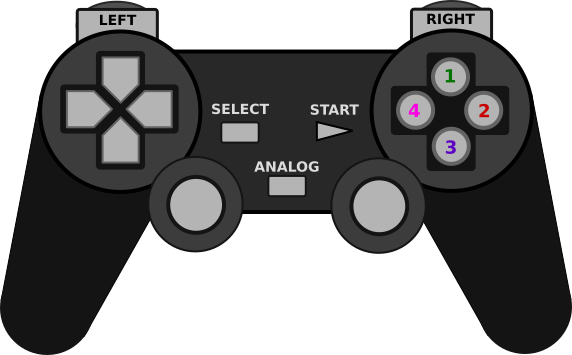

# Tinkering with RaspberryPi
TODO add temperature sensor scripts (lrs)

TODO cloc --exclude-dir=third_party,.venv,sunfounder-patched .

## Sunfounder's "Smart Video Car" Kit

* Control the car with a gamepad: `car-ctrl-gamepad`

* Receive and view the webcam stream from the car's bluetooth server: `car-bluetooth-image-client`

### car-ctrl-gamepad

TODO visualize current button mapping
Check pi_gamepad_ctrl.sh
params

### car-bluetooth-image-client
Connects to the server running on the pi-car (if you started `car-ctrl-gamepad`) and views the webcam stream

